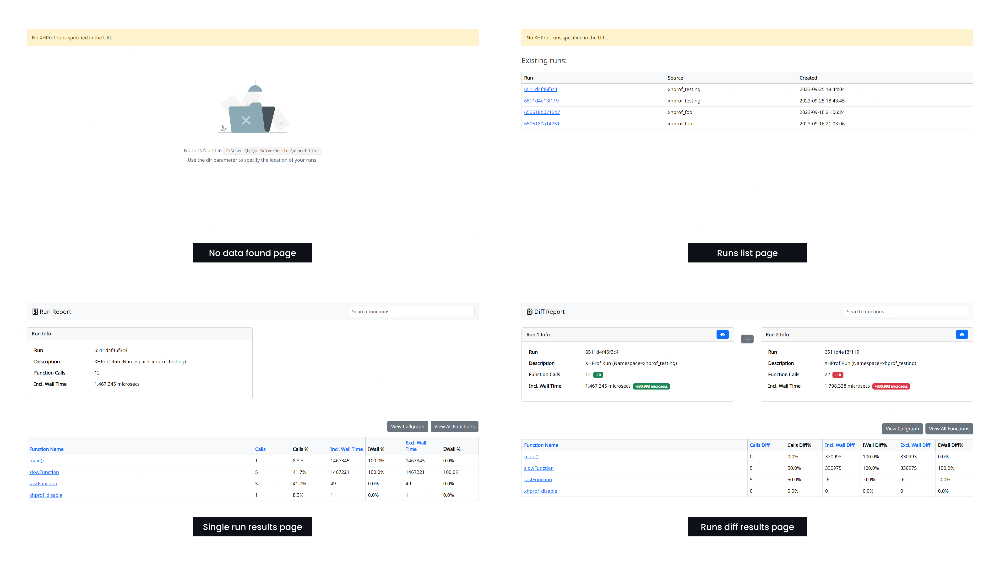

# xhprof-html

xhprof (or tideways) visualize html tool.
This repository some modified for especially solo usage from [xhprof repository](https://github.com/phacility/xhprof). 

## Enhancements

Facing the challenge of slow PHP code execution, I sought a solution to gain deeper insights into the performance bottlenecks. That's when I discovered the [xhprof-html](https://github.com/sters/xhprof-html) library, a valuable tool for visualizing xhprof profiling results.

Initially, the tool lacked any styling, presenting the data in a rather basic and unattractive manner. However, as someone who found great value in its functionality, I decided to take it a step further.

I embarked on a project to enhance the design of the tool by integrating Bootstrap CSS, with the goal of making it more pleasing and user-friendly. This transformation not only improved the visual appeal of the tool but also made it more accessible to users seeking to analyze and optimize their PHP code performance.

I also took the intiative to redesign the documentation, enhancing it with a more contemporary appearance and simplified sidebar navigation by using a modern template called [coderDocs](https://themes.3rdwavemedia.com/bootstrap-templates/product/coderdocs-free-bootstrap-5-documentation-template-for-software-projects/)

I hope that these enhancements will make the tool more appealing to users and encourage them to take advantage of its powerful features. 

## Screenshots



## Usage

1. clone repo
2. `php -S localhost:8000`
3. Access `http://localhost:8000/?dir={Your xhprof profiling result dir}`


## Tideways example

1. Install [tideways extension](https://github.com/tideways/php-xhprof-extension)
2. Write code and save profiler result.

```
<?php

tideways_xhprof_enable();

my_application();

$data = tideways_xhprof_disable();

$filename = '/tmp/' . intval(microtime(true)) . mt_rand(1,10000) . '.xhprof';
file_put_contents($filename, serialize($data));
echo 'Profile Result: ' . $filename;
```

3. Start this web app at PHP build-in server.

```
$ php -S localhost:8000
```

4. Access `http://localhost:8000/?dir=/tmp`

5. Enjoy profiling!


## Other xhprof visualization tools

You can find other visualization tools on [GitHub Topics](https://github.com/topics/xhprof?o=desc&s=stars)!
